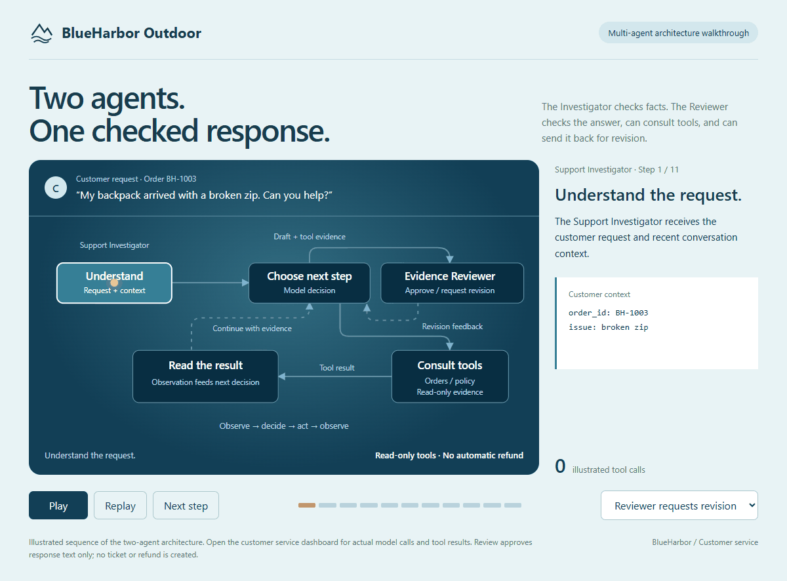

# Product Customer Service

A customer-service demo that answers product, policy and order questions from uploaded files.

- **PDF knowledge:** upload product descriptions, return policies or other text PDFs; answers reference filenames and pages.
- **CSV orders:** look up exact order IDs, with original fields and record references.
- **Multi-agent loop:** a Support Investigator calls tools and drafts a response; an independent Evidence Reviewer approves it or requests a revision. The interface shows live tool calls and review events.
- **Persistent library:** select, archive and restore uploaded files; data survives restarts.

The animation above illustrates the workflow. Live execution appears in the customer-service interface. Open `demo/agent-loop.html` for the interactive animation.

## Run locally

From the project directory, run:

```powershell
python -m venv .venv
.\.venv\Scripts\python.exe -m pip install -r requirements.txt
```

Create a `.env` file with your tool-calling model configuration:

```dotenv
AIROBOT_AGENT_ENGINE=loop
AIROBOT_LLM_BASE_URL=https://generativelanguage.googleapis.com/v1beta/openai/
AIROBOT_LLM_MODEL=gemini-3.8-flash
AIROBOT_LLM_API_KEY=your-api-key
```

An OpenAI-compatible service with native tool calling can also be configured. No embedding API is needed.

```powershell
.\.venv\Scripts\python.exe -m uvicorn app.main:app --host 127.0.0.1 --port 8000
```

Open [Customer service](http://127.0.0.1:8000/dashboard) or the [interactive agent-loop animation](http://127.0.0.1:8000/agent-workflow).

In **Knowledge and orders**, upload files, select them, then ask a question. CSV files should use UTF-8 and an order-ID column such as `order_id`; other headings can be specified in the upload form. PDF files need selectable text—image-only scans require OCR first. Files are limited to 20 MB each and PDFs to 50 pages.

Uploaded files are stored locally in `data/library/`. This local demo provides read-only answers; it does not execute refunds or other business actions.
